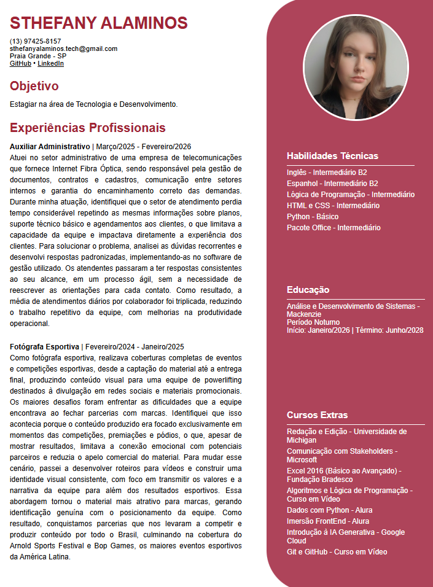

# 📄 Web RCurriculum
Personal curriculum developed in HTML5 and CSS3 as an academic project for the Systems Analysis and Development course - Mackenzie.

<a href="https://sthefanyalaminos.github.io/curriculum_html5/">Click here to access!</a>

---
This project was developed as an academic assignment in the Web Fundamentals course of Systems Analysis and Development at Universidade Presbiteriana Mackenzie, with the goal of practicing:

- Semantic structuring with HTML5;
- Positioning and layout with CSS Grid;
- Responsive design with media queries;
- Code organization best practices.

## Technologies Used
- HTML5;
- CSS3 with Grid Layout.

## Features
- CSS Grid layout with two columns;
- Responsive design with a mobile breakpoint (max-width: 600px);
- Sidebar with rounded corners and its own visual identity;
- Links to GitHub and LinkedIn;
- Color palette in shades of burgundy/wine.